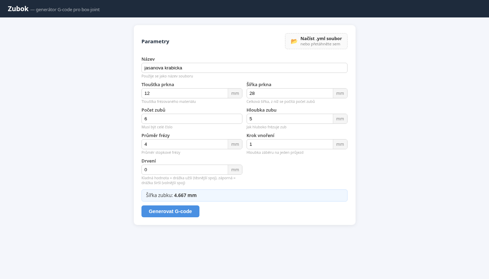
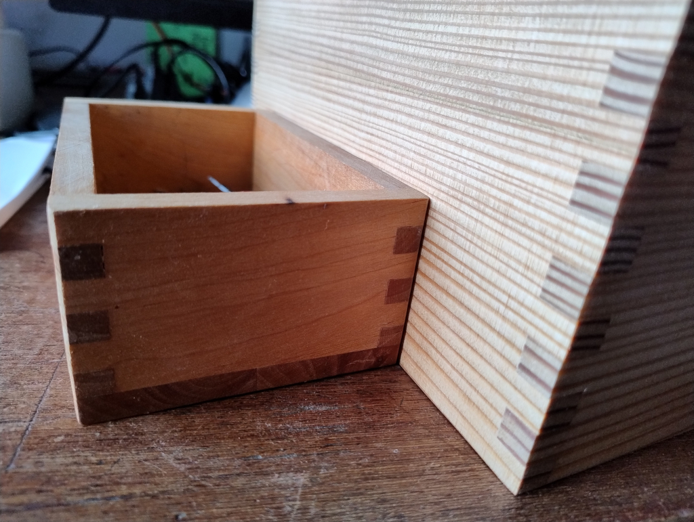

# Zubok Online

Webová aplikace pro generování CNC G-code pro frézování **box-joint (prstových spojů)** ze dřeva.

Přepis původního Ruby skriptu do moderního Node.js/Vue 3 stacku s 3D vizualizací dráhy frézy.





## Funkce

- Zadání parametrů přes formulář (tloušťka prkna, šířka, počet zubů, průměr frézy, …)
- Import parametrů z `.yml` souboru
- Generování dvou G-code souborů (`_a.nc` a `_b.nc`) pro obě prkna spoje
- 3D vizualizace dráhy frézy v reálném čase (Three.js)
- Animace průjezdu frézy podél dráhy
- Stažení G-code přímo v prohlížeči

## Technologie

| Vrstva | Stack |
|--------|-------|
| Backend | Node.js, Express 5 |
| Frontend | Vue 3, Vite |
| 3D vizualizace | Three.js, OrbitControls |
| Bezpečnost | Helmet, express-rate-limit |

## Spuštění

### Vývoj

```bash
npm install
npm run dev
```

Frontend běží na `http://localhost:5173`, backend na `http://localhost:3000`.

### Produkce

```bash
npm run build
npm start
```

Aplikace běží na `http://localhost:3000` (Express servíruje i statické soubory).

## Parametry

| Parametr | Popis |
|----------|-------|
| Název | Použije se jako název výstupního souboru |
| Tloušťka prkna | Tloušťka frézovaného materiálu (mm) |
| Šířka prkna | Celková šířka, z níž se počítá počet zubů (mm) |
| Počet zubů | Celé číslo |
| Hloubka zubu | Jak hluboko frézuje zub (mm) |
| Průměr frézy | Průměr stopkové frézy (mm) |
| Krok vnoření | Hloubka záběru na jeden průjezd (mm) |
| Drvení | Kladná = těsnější spoj, záporná = volnější spoj (mm) |

## Výstup

Aplikace vygeneruje dva G-code soubory:

- `<nazev>_a.nc` — program pro první prkno
- `<nazev>_b.nc` — program pro druhé prkno (zrcadlový spoj)

## Struktura projektu

```
zubok-online/
├── server/
│   ├── index.js        # Express server, /api/generate, security middleware
│   └── zubok.js        # G-code generátor (přepis zubok.rb)
├── client/
│   └── src/
│       ├── App.vue                      # Hlavní layout, API volání
│       └── components/
│           ├── ParamsForm.vue           # Formulář parametrů
│           ├── FileUpload.vue           # Import .yml souboru
│           └── CanvasView3D.vue         # Three.js 3D vizualizace
└── examples/
    └── zubky/
        ├── zubok.rb    # Původní Ruby skript (reference)
        └── zubok.yml   # Příklad parametrů
```

## Licence

MIT
